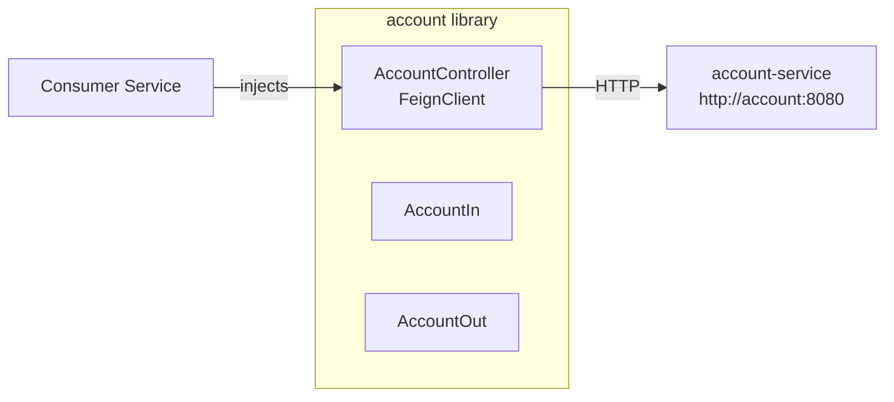

# pma.261.account

Feign client library for the `account-service`. Other services import this artifact to communicate with the account service via HTTP without writing boilerplate REST code.

## Overview

The `account` module exposes a `@FeignClient` interface (`AccountController`) that maps each account endpoint to a typed Java method, along with the shared DTOs (`AccountIn`, `AccountOut`) used in requests and responses.



## Stack

| Layer | Technology |
|---|---|
| Language | Java 25 |
| Framework | Spring Boot 4.x + Spring Cloud OpenFeign |
| Utilities | Lombok |

## Endpoints

The client targets `http://account:8080` (the `account-service` container on the internal Docker network).

| Method | Path | Description |
|---|---|---|
| `POST` | `/accounts` | Create a new account. Returns `201 Created` with a `Location` header. |
| `DELETE` | `/accounts/{id}` | Delete an account by ID. Returns `204 No Content`. |
| `GET` | `/accounts` | List all accounts. |
| `GET` | `/accounts/{id}` | Retrieve a single account by ID. |
| `POST` | `/accounts/login` | Find an account by email + password (used internally by auth-service). |
| `GET` | `/accounts/health-check` | Liveness probe. Returns `200 OK`. |

## Request / Response Models

### `AccountIn`
```json
{
  "name": "Jane Doe",
  "email": "jane@example.com",
  "password": "secret"
}
```
> `name` is optional for login; only `email` and `password` are used in that case.

### `AccountOut`
```json
{
  "id": "550e8400-e29b-41d4-a716-446655440000",
  "name": "Jane Doe",
  "email": "jane@example.com"
}
```
> Passwords are never returned.

## Usage

Add the dependency to your `pom.xml`:

```xml
<dependency>
    <groupId>store</groupId>
    <artifactId>account</artifactId>
    <version>1.0.0</version>
</dependency>
```

Enable Feign clients in your Spring Boot application:

```java
@EnableFeignClients(basePackages = "store.account")
@SpringBootApplication
public class YourApplication { ... }
```

Inject and use:

```java
@Autowired
private AccountController accountController;

// Create an account
accountController.create(AccountIn.builder()
    .name("Jane Doe")
    .email("jane@example.com")
    .password("secret")
    .build()
);

// Fetch by ID
AccountOut account = accountController.findById(id).getBody();
```

## Build

```bash
mvn clean install
```

The artifact is installed to the local Maven repository and can then be consumed by other services in this monorepo.
